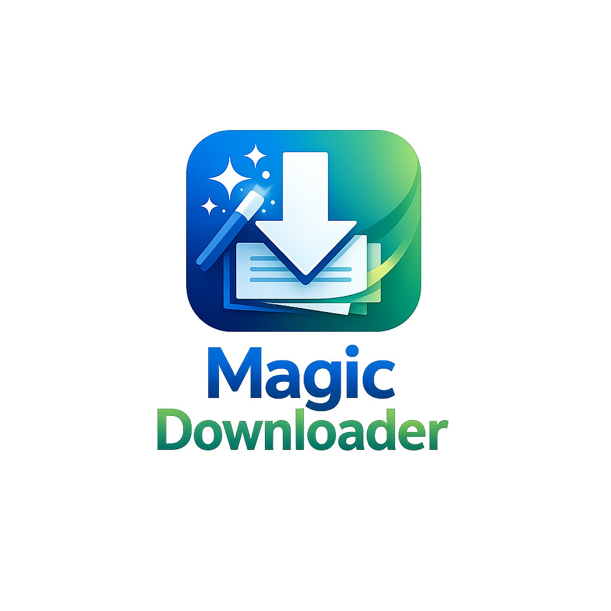

<p align="center"></p>

# Magic Downloader

An **Internet Download Manager (IDM)–style** multi-connection download manager for Windows, with a **real browser extension** and a **download button right on video players**.

[](https://github.com/Bayoumi68/Magic-Downloader/releases/latest)
[](https://github.com/Bayoumi68/Magic-Downloader/releases)
[](LICENSE)

## ⬇️ Download — latest version: **v0.5.7**

**[Get the latest release →](https://github.com/Bayoumi68/Magic-Downloader/releases/latest)**

_These links always point to the newest version (the filenames never change):_

- **Installer** (recommended): [`MagicDownloader-Setup.exe`](https://github.com/Bayoumi68/Magic-Downloader/releases/latest/download/MagicDownloader-Setup.exe) — Start-menu shortcut + uninstaller, installs per-user (no admin).
- **Installer, zipped** (use this if your browser/antivirus blocks or renames the `.exe`): [`MagicDownloader-Setup.zip`](https://github.com/Bayoumi68/Magic-Downloader/releases/latest/download/MagicDownloader-Setup.zip) — unzip, then run the installer inside.
- **Portable** (no install): [`MagicDownloader-win64.zip`](https://github.com/Bayoumi68/Magic-Downloader/releases/latest/download/MagicDownloader-win64.zip) — unzip and run `MagicDownloader.exe`.

> **Why the “harmful / unknown publisher” warning?** The app is **not code-signed** (a signing certificate costs money), so Windows SmartScreen and some antivirus flag it as *unrecognized* — not because anything is actually wrong. It's open-source; you can build it yourself. Verify your download against [`SHA256SUMS.txt`](https://github.com/Bayoumi68/Magic-Downloader/releases/latest/download/SHA256SUMS.txt) (`Get-FileHash file -Algorithm SHA256`).
>
> To install anyway: on the SmartScreen prompt click **More info → Run anyway**; if your antivirus quarantines it, restore it / add an exclusion. See [PUBLISHING.md](PUBLISHING.md).
> Browser extension: install from [`browser_extension/`](browser_extension/) (Chrome/Edge) or [FIREFOX_INSTALL.md](FIREFOX_INSTALL.md) (Firefox).

## Features (IDM-inspired)

| Feature | Description |
|--------|-------------|
| **🎬 Video grabber** | Detects video on any page and downloads it — **YouTube, Vimeo & ~1800 sites** via yt-dlp, plus direct **HLS (`.m3u8`)** / **DASH (`.mpd`)** streams — merged into one MP4 |
| **Download button on videos** | The extension overlays a blue **“⬇ Download”** button on `<video>` players and shows a badge with how many videos it found on the page |
| **All qualities & formats** | The popup lists **every** available quality + format (1080p MP4, 720p, audio-only M4A, …) — pick one, IDM-style |
| **ffmpeg auto-install** | One-click **Options → Video → Install ffmpeg** to enable clean merged-MP4 output |
| **Speed limiter** | Global download speed cap (KB/s), like IDM |
| **System tray** | Closing the window keeps it running in the tray (IDM-style); only **Exit** quits. Right-click the tray icon to show, pause/resume all, or exit |
| **Multi-connection downloads** | Split files (and stream segments) into parallel connections for higher speed |
| **Pause / Resume** | Stop and continue downloads; partial files and stream segments are kept |
| **Queue** | Multiple downloads managed together |
| **Progress UI** | Filename, size, status, progress, speed, ETA, connections, segment map |
| **Categories** | Save to folders by type (General, Compressed, Documents, Music, Video) |
| **Browser integration** | Chrome/Edge/Brave extension: network media sniffing, right-click links, capture browser downloads |
| **History** | Completed downloads listed; open file / folder |
| **Settings** | Connections per download, max simultaneous downloads, default save path |

### How the video grabber works

Video sites deliver two very different kinds of streams, and Magic Downloader handles both:

**1. YouTube / Vimeo / social & ~1800 other sites (yt-dlp).**
These hide their media behind signature-ciphered URLs buried in page JavaScript — there's nothing to right-click. When the extension sees a `<video>` on a supported page it offers **“This page's video.”** Click it (or the toolbar icon) → the app runs **yt-dlp**, lists **every** quality/format, and downloads + merges the one you pick.

You can also do it **entirely in the desktop app**: **Tasks → Download video (choose quality)** (`Ctrl+D`), paste a URL, click **Fetch formats**, pick a quality, and download. Right-click any video job → **🎬 Choose quality…** to re-download at a different quality.

> **Login/cookies:** by default the app downloads YouTube **anonymously** — passing a logged-in session's cookies makes YouTube serve DRM/SABR formats that fail with *"format is not available."* Public videos work without cookies.

**2. Direct HLS / DASH streams (built-in engine).**
On sites that expose an `.m3u8`/`.mpd` manifest, the extension **sniffs network traffic**, and the app fetches **every segment in parallel**, decrypts AES-128 HLS if needed, and merges them.

**ffmpeg** is used to mux video+audio into a clean **`.mp4`** (YouTube's best formats, DASH, and fMP4 HLS all deliver video and audio separately). It's **auto-detected** on `PATH`, or install it in one click from **Options → Video → Install ffmpeg**. Without ffmpeg the app still works — it picks the best single-file quality (yt-dlp) or saves a raw **`.ts`** (HLS) — and tells you to install ffmpeg for the best merged MP4.

> **Note on YouTube:** downloading may be against a site's Terms of Service. Only download content you have the right to. yt-dlp is maintained upstream; if a site changes and breaks extraction, update it with `pip install -U yt-dlp`.

## Requirements

- Python 3.10+
- Windows recommended (works on other OSes with Tk)

## Install

```powershell
cd E:\PycharmProjects\Magic_downloader
python -m venv .venv
.\.venv\Scripts\Activate.ps1
pip install -r requirements.txt
```

## Run

```powershell
python main.py
```

Or:

```powershell
python -m magic_downloader
```

## Usage

1. Click **Add URL** (or press `Ctrl+N`)
2. Paste a direct download link, choose save folder and connections
3. Click **Download** — watch progress in the main list
4. Use **Pause**, **Resume**, **Cancel**, **Delete**, **Open file / folder** from the toolbar or right-click menu

## Browser integration (Chrome / Edge / Brave)

Magic Downloader listens on **`http://127.0.0.1:7373`** (configurable) while the app is open.

1. Start the app — toolbar should show **Browser: :7373**
2. Load the unpacked extension from `browser_extension/`  
   See [browser_extension/README.md](browser_extension/README.md) for step-by-step install
3. On a YouTube (or other) video, click the extension **toolbar icon** → the popup lists **“This page's video”** with a quality dropdown → pick one → it downloads here
4. On sites with a direct `<video>`, the blue **“⬇ Download”** button appears on the player
5. Right-click a link → **Download with Magic Downloader**  
   Or turn on **Capture browser downloads** in the extension popup (IDM-style takeover)

When a download is captured, the app pops the IDM-style **Download File Info** dialog so you can set the **file name**, **category**, and **save folder** before it starts (Start / Download Later / Cancel). Turn it off in **Options → Browser** to start captures silently.

Cookies and referrer are passed when available so authenticated links and streams work better.

### ffmpeg (recommended for video)

Easiest: open the app → **Options → Video → “⬇ Install ffmpeg automatically.”** It downloads a static build into a local `bin/` folder — no PATH changes needed.

Alternatively install ffmpeg yourself and either add it to `PATH`, drop `ffmpeg.exe` into a `bin/` folder next to `main.py`, or point **Options → Video → ffmpeg path** at it. The extension popup and the app both show whether ffmpeg was found. It's only needed to merge video+audio — regular file downloads never require it.

## Project layout

```
Magic_downloader/
├── main.py
├── requirements.txt
├── browser_extension/      # Chrome/Edge MV3 extension (video sniffing + button)
├── magic_downloader/
│   ├── browser_server.py   # Localhost API for the extension (/ping /probe /add)
│   ├── config.py
│   ├── engine.py           # Multi-connection HTTP file downloader
│   ├── manager.py          # Queue; routes videos to the right engine
│   ├── ratelimit.py        # Global speed limiter (token bucket)
│   ├── media/              # Video grabber
│   │   ├── detect.py       # http | hls | dash | page classifier
│   │   ├── hls.py          # .m3u8 parser (variants, AES-128, fMP4)
│   │   ├── dash.py         # .mpd parser (SegmentTemplate/Timeline/List/Base)
│   │   ├── media_engine.py # Download HLS/DASH segments + assemble
│   │   ├── ytdlp_engine.py # YouTube/site videos via yt-dlp (all formats)
│   │   ├── ffmpeg.py       # Locate ffmpeg + mux/concat
│   │   ├── ffmpeg_installer.py  # One-click ffmpeg download
│   │   └── probe.py        # Quality discovery for the picker
│   └── gui/
└── data/
```

## Notes

- Best results with **direct HTTP(S) file URLs** that support range requests (`Accept-Ranges`).
- **Page videos** (YouTube etc.) go through **yt-dlp**; **streaming manifests** (HLS/DASH) go through the built-in engine. **DRM-protected** streams (Widevine/PlayReady/FairPlay) are **not** downloadable — those keys aren't accessible to any downloader.
- **AES-128** encrypted HLS needs the `cryptography` package (in `requirements.txt`). Unencrypted streams work without it.
- Keep yt-dlp current with `pip install -U yt-dlp` — sites change and yt-dlp ships fixes frequently.
- This is an educational / personal tool inspired by classic download managers, not affiliated with IDM. Only download content you have the right to.
